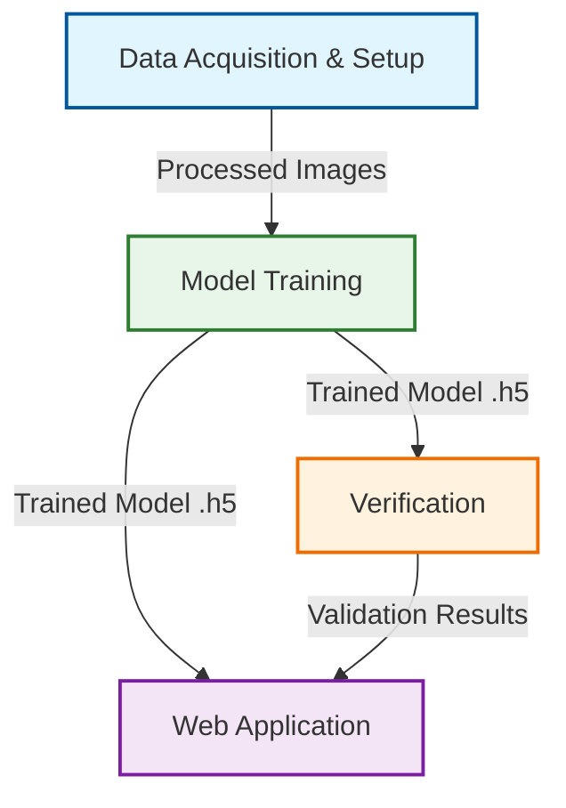

# Traffic Sign Recognition Project

**Date:** January 06, 2026
**Project Type:** Computer Vision / Machine Learning
**Tech Stack:** Python, TensorFlow/Keras, Streamlit

---

## 1. Executive Summary
This project is a **Traffic Sign Recognition System** capable of identifying various German traffic signs (e.g., Stop, Speed Limits, No Entry) from images or a webcam feed. The system uses a **Convolutional Neural Network (CNN)** trained on the GTSRB (German Traffic Sign Recognition Benchmark) dataset to classify images with high accuracy.

The application allows users to interact with the model via a user-friendly web interface tailored for real-time demonstrations.

---

## 2. High-Level Workflow
The project follows a standard Machine Learning pipeline consisting of four main stages:



---

## 3. Detailed Component Breakdown

### Step 1: Data Setup (`data_setup.py`)
**Goal:** Prepare the raw dataset for the neural network.

*   **Source:** Downloads the "German Traffic Sign Recognition Benchmark" (GTSRB) dataset.
*   **Filtering:** Selects specific relevant classes (e.g., Stop, Yield, Speed Limit 30) to keep the model focused and efficient.
*   **Splitting:** divides data into:
    *   **Training Set (80%)**: Used to teach the model.
    *   **Validation Set (20%)**: Used to evaluate performance during training.
*   **Preprocessing:** Converts all images to a standard format (PNG) and organizes them into labeled folders.

### Step 2: Model Training (`train.py`)
**Goal:** Teach the AI to recognize patterns in the traffic signs.

*   **Architecture:** Uses a **Convolutional Neural Network (CNN)**. Think of this as a grid scanner that looks for:
    *   **Edges/Lines** (First layers)
    *   **Shapes/Curves** (Middle layers)
    *   **Complex patterns** (Final layers)
*   **Data Augmentation:** artificially increases the dataset size by:
    *   Rotating images slightly
    *   Zooming in/out
    *   Adjusting brightness/contrast
    *   *Why?* This helps the model recognize signs even in bad weather or poor lighting.
*   **Output:** Saves the trained "brain" to `traffic_sign_model.h5` and a list of sign names to `labels.txt`.

### Step 3: Verification (`verify_model.py`)
**Goal:** Ensure the model works correctly before deployment.

*   Loads the saved model.
*   Tests one random image from every single class in the validation folder.
*   Reports **PASS/FAIL** and the confidence score.
*   *Use Case:* Run this script 5 minutes before your presentation to ensure everything is working perfectly.

### Step 4: Web Application (`app.py`)
**Goal:** The user-facing interface for demonstration.

*   **Framework:** Built with **Streamlit**, which allows for rapid creation of data apps.
*   **Features:**
    *   **Upload Mode:** Upload any image file to test.
    *   **Webcam Mode:** Real-time capture for live demos (hold a sign to your camera).
    *   **Confidence Scores:** Shows how sure the AI is about its guess.
    *   **Top 3 Predictions:** Useful for debugging if the model is confused (e.g., confusing "Speed Limit 30" with "Speed Limit 50").

---

## 4. How the Code Works (Key Technical Concepts)

### The "Eye" (Convolutional Layers)
The code uses `Conv2D` layers. These layers slide a small filter (like 3x3 pixels) over the image to detect features.
```python
layers.Conv2D(32, 3, padding='same', activation='relu')
```
*   `32`: Number of filters (feature detectors).
*   `relu`: Activation function that removes negative values (keeps only important signals).

### The "Brain" (Dense Layers)
After scanning the image features, the data is flattened into a long list and passed to `Dense` layers, which make the final decision.
```python
layers.Dense(num_classes, activation='softmax')
```
*   `softmax`: Converts the final numbers into probabilities (e.g., 95% Stop Sign, 3% Yield, 2% Other).

---

## 5. Demonstration Workflow (For Your Presentation)

1.  **Setup:** Show the code structure in VS Code.
2.  **Training (Optional):** Briefly explain `train.py`, but say *"I have pre-trained the model to save time."*
3.  **Verification:** Run `python verify_model.py` in the terminal to show the "PASS" results. This builds confidence.
4.  **The App:** Run `streamlit run app.py`.
5.  **Live Demo:**
    *   Select **Webcam** mode.
    *   Hold up a picture of a Stop sign (on your phone or printed).
    *   Show how the model detects it instantly.
    *   Try a harder one (like a speed limit) to show off the robust training.

## 6. Commands to Run
**Train the model:**
```bash
python data_setup.py
python train.py
```

**Verify performance:**
```bash
python verify_model.py
```

**Launch the App:**
```bash
streamlit run app.py
```
